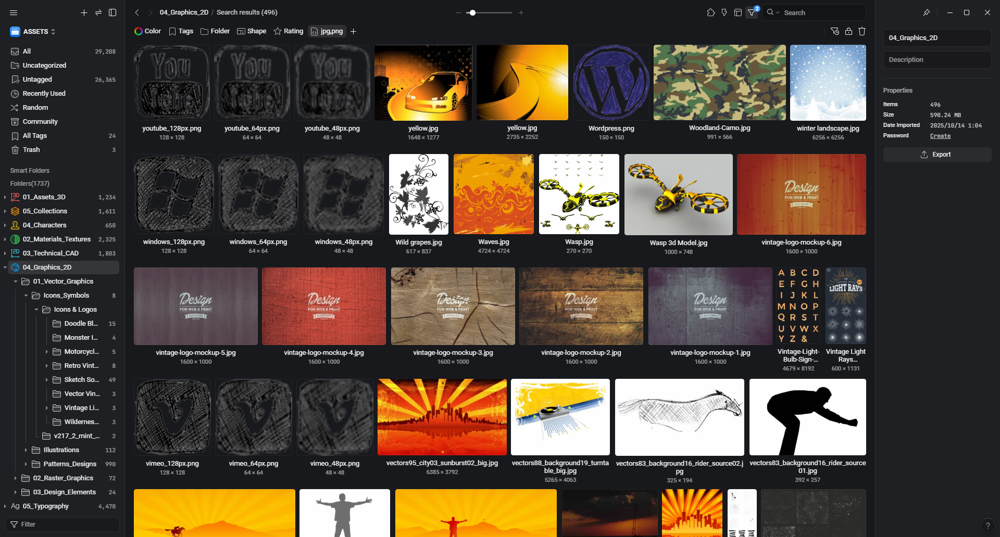
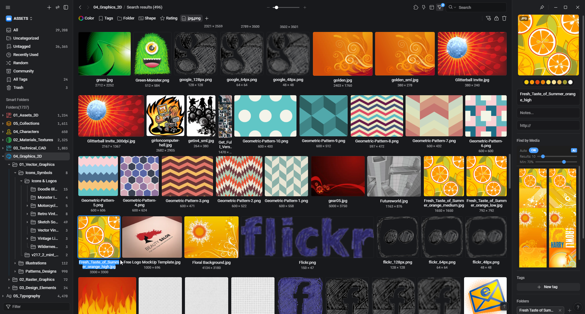

# Find by Media

**Select an image, instantly find similar ones in your Eagle library.**

An inspector plugin for [Eagle](https://eagle.cool) that uses AI-powered visual similarity search — completely offline, no cloud, no API keys.


---

## What Does It Do?

Ever saved thousands of images in Eagle but struggled to find *that one* similar reference? Find by Media solves this.

**Select any image** in Eagle, and the plugin instantly shows you visually similar images from your entire library — not just by color or filename, but by what's actually *in* the image.

- Select a chair, find all similar chairs in your library
- Select a texture, find matching textures and patterns
- Select an interior shot, find rooms with similar style

## Features

- **AI-Powered Search** — Uses neural network (MobileNet V2) to understand image content, not just pixels
- **Instant Results** — Select an image, results appear automatically in the inspector panel
- **100% Offline** — Everything runs on your machine. No cloud, no API keys, no data leaves your computer
- **Smart Caching** — First scan indexes your library once, then every search is instant
- **Adjustable** — Control result count and similarity threshold with simple sliders
- **Dark & Light Theme** — Adapts to your Eagle theme automatically

## Screenshots

| Search Results | Settings | Preview |
|:-:|:-:|:-:|
|  |  |  |

## Installation

1. **Download** this repository (Code > Download ZIP)
2. **Unzip** and move the folder to your Eagle plugins directory
3. **Open terminal** inside the folder and run:
   ```
   npm install
   ```
4. **Download the AI model** (~14MB):
   ```
   mkdir models
   curl -L -o models/mobilenetv2-7.onnx https://github.com/onnx/models/raw/main/validated/vision/classification/mobilenet/model/mobilenetv2-7.onnx
   ```
   > On Windows? You can simply [download the model directly](https://github.com/onnx/models/raw/main/validated/vision/classification/mobilenet/model/mobilenetv2-7.onnx) and place it in the `models/` folder.
5. **Reload Eagle** — the plugin appears in the inspector panel when you select an image

## Supported Formats

jpg, jpeg, png, gif, bmp, webp, svg, tiff, tif, ico

## How It Works

The plugin combines three different analysis methods for the best results:

| Method | What it does | Weight |
|--------|-------------|--------|
| Neural Embedding | Understands image content (objects, scenes, style) | 60% |
| Perceptual Hash | Detects structural similarity and near-duplicates | 25% |
| Color Analysis | Matches color palette and tone | 15% |

If the AI model isn't available, the plugin gracefully falls back to pixel-level analysis (hash + color) — still useful for finding duplicates and color-similar images.

## FAQ

**Q: Does it slow down Eagle?**
A: No. The initial indexing runs in the background and only happens once per library. After that, searches are instant thanks to caching.

**Q: How big is the AI model?**
A: ~14MB. It runs locally using your GPU via WebGL — no internet needed after download.

**Q: Does it send my images anywhere?**
A: Absolutely not. Everything is processed locally on your machine. Zero network calls.

**Q: My library has 10,000+ images. Will it work?**
A: Yes. The indexer processes images in chunks and caches results. First index takes a while, but subsequent sessions are instant.

---

## Support

If you find this plugin useful, consider supporting its development:

<a href="https://buymeacoffee.com/burakgobut">
  
</a>

---

## License

MIT License — free to use, modify, and share.

## Credits

Built with [ONNX Runtime](https://onnxruntime.ai/) and [MobileNet V2](https://github.com/onnx/models/tree/main/validated/vision/classification/mobilenet) for the [Eagle](https://eagle.cool) community.
